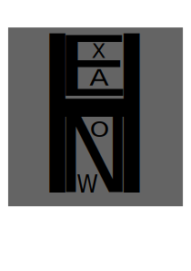
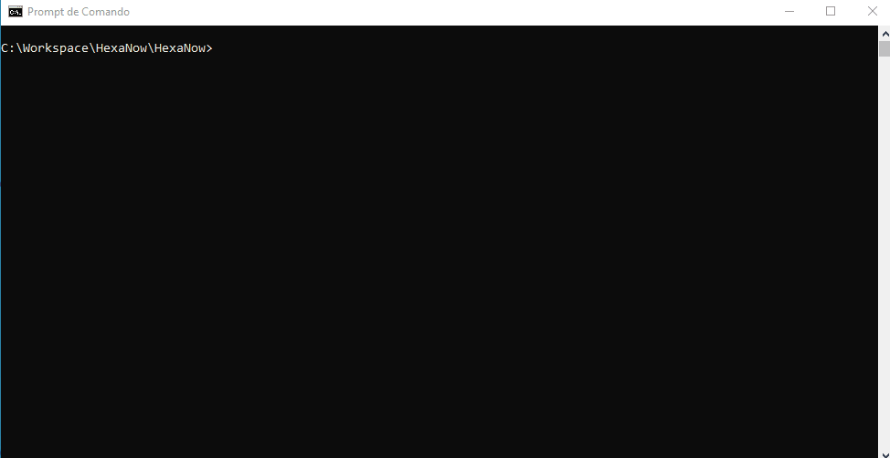

# HexaNow   

</br>
👉 É um conversor de palavras que obtêm o caracter informado e converte em código HexaDecimal.
</br>

### Modo básico de Uso:
_____
#### Informe a palavra ou uma frase
- Ola Mundo!!

#### A palavra ou frase fica disponivel na área de tranferência
- 4FH 6CH 61H 20H 4DH 75H 6EH 64H 6FH 21H 21H 

#### 💻👀 Demonstração 👀💻



</br>
</br>

# 💻 Desenvolvimento

👉 A versão atual atende as necessidades básicas. Existem algumas limitações que necessitam de melhorias.

#### Melhorias
- Permitir a inclusão de um número maior de caracteres. A versão atual só permite informar 32 caracteres
- Pausar a Listagem da exibição da tabela ascii

#### Compilação

Para compilar suas alterações, estão disponíveis arquivos bat. Mas sua execução precisa seguir uma ordem.

```
c:\Workspace\HexaNow> cd object
c:\Workspace\HexaNow\object> compile_color_control.bat
c:\Workspace\HexaNow\object> compile_ASC_OBJECT.bat
c:\Workspace\HexaNow\object> compileLinker.bat
c:\Workspace\HexaNow\object> cd ..
c:\Workspace\HexaNow> compileHexaNow.bat
```
#### ⚠️ ATENÇÃO ⚠️
___________

O comando ***compileHexaNow.bat*** realiza o link com os outros objetos dependentes. Portanto é necessário sempre que realizar a alteração em determinado objeto, executar seu comando ****.bat***. Em seguida o ***compileHexaNow.bat***.

# Sobre

👉 A motivação para sua criação foi a necessidade de disponibilizar mensagens embarcadas em Projetos Microcontrolados. O desenvolvimento de toda base tecnológica de meus projetos microcontrolados estão em Assembly. Todo o conteúdo de mensagem embarcado no Microcontrolador necessita estar no formaro Hexadecimal ou binário. Com isso e a idéia de explorar o desenvolvimento em linguagem ***C***, codifiquei essa pequena ferramenta.


